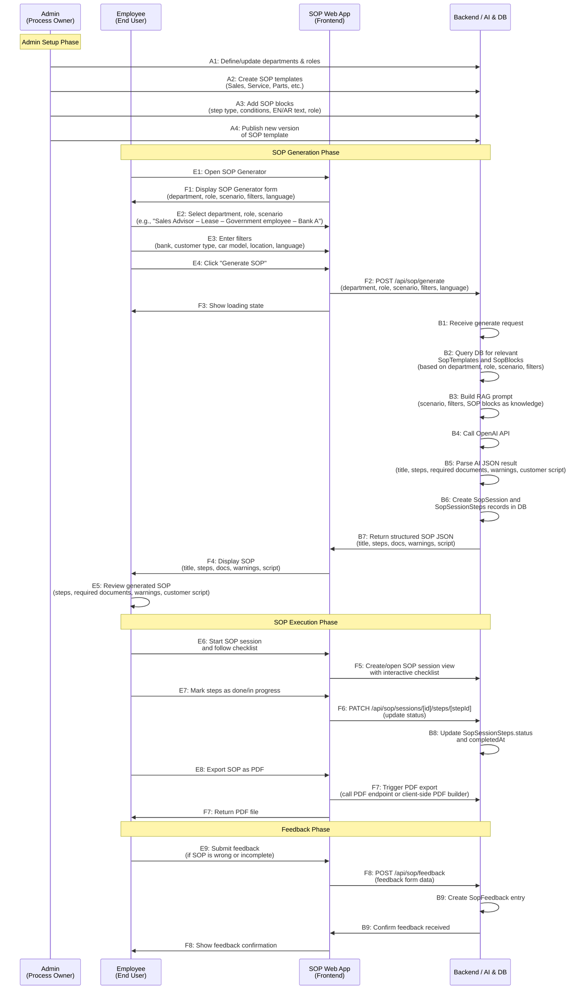

# AI SOP Generator - Swimlane Diagram

## Mermaid Swimlane Diagram



## Alternative: Structured Text Layout for draw.io

```
┌─────────────────────────────────────────────────────────────────────────────┐
│                           ADMIN (Process Owner)                             │
├─────────────────────────────────────────────────────────────────────────────┤
│ A1: Define/update departments & roles                                       │
│     │                                                                        │
│     ▼                                                                        │
│ A2: Create SOP templates (Sales, Service, Parts, etc.)                      │
│     │                                                                        │
│     ▼                                                                        │
│ A3: Add SOP blocks (step type, conditions, EN/AR text, role)                 │
│     │                                                                        │
│     ▼                                                                        │
│ A4: Publish new version of SOP template                                      │
│     │                                                                        │
│     └───────────────────────────────────────────────────────────────────────┘
│
┌─────────────────────────────────────────────────────────────────────────────┐
│                          EMPLOYEE (End User)                                 │
├─────────────────────────────────────────────────────────────────────────────┤
│ E1: Open SOP Generator                                                       │
│     │                                                                        │
│     ▼                                                                        │
│ E2: Select department, role, scenario                                        │
│     (e.g., "Sales Advisor – Lease – Government employee – Bank A")          │
│     │                                                                        │
│     ▼                                                                        │
│ E3: Enter filters (bank, customer type, car model, location, language)      │
│     │                                                                        │
│     ▼                                                                        │
│ E4: Click "Generate SOP"                                                     │
│     │                                                                        │
│     ▼                                                                        │
│ E5: Review generated SOP (steps, required documents, warnings, script)       │
│     │                                                                        │
│     ▼                                                                        │
│ E6: Start SOP session and follow checklist                                  │
│     │                                                                        │
│     ▼                                                                        │
│ E7: Mark steps as done/in progress                                          │
│     │                                                                        │
│     ▼                                                                        │
│ E8: Export SOP as PDF                                                        │
│     │                                                                        │
│     ▼                                                                        │
│ E9: Submit feedback if SOP is wrong or incomplete                            │
│
┌─────────────────────────────────────────────────────────────────────────────┐
│                        SOP WEB APP (Frontend)                                │
├─────────────────────────────────────────────────────────────────────────────┤
│ F1: Display SOP Generator form                                               │
│     (department, role, scenario, filters, language)                          │
│     │                                                                        │
│     ▼                                                                        │
│ F2: Send generate request to /api/sop/generate with all inputs              │
│     │                                                                        │
│     ▼                                                                        │
│ F3: Show loading state                                                       │
│     │                                                                        │
│     ▼                                                                        │
│ F4: Display SOP returned by backend                                         │
│     (title, steps, docs, warnings, script)                                   │
│     │                                                                        │
│     ▼                                                                        │
│ F5: Create or open SOP session view with interactive checklist               │
│     │                                                                        │
│     ▼                                                                        │
│ F6: On checkbox toggle, call /api/sop/sessions/[id]/steps/[stepId]          │
│     to update status                                                         │
│     │                                                                        │
│     ▼                                                                        │
│ F7: Trigger PDF export (call PDF endpoint or client-side PDF builder)      │
│     │                                                                        │
│     ▼                                                                        │
│ F8: Send feedback form data to /api/sop/feedback                             │
│
┌─────────────────────────────────────────────────────────────────────────────┐
│                        BACKEND / AI & DB                                     │
├─────────────────────────────────────────────────────────────────────────────┤
│ B1: Receive generate request                                                │
│     │                                                                        │
│     ▼                                                                        │
│ B2: Query DB for relevant SopTemplates and SopBlocks                         │
│     (based on department, role, scenario, filters)                           │
│     │                                                                        │
│     ▼                                                                        │
│ B3: Build RAG prompt with scenario, filters and SOP blocks as knowledge      │
│     │                                                                        │
│     ▼                                                                        │
│ B4: Call OpenAI API                                                          │
│     │                                                                        │
│     ▼                                                                        │
│ B5: Parse AI JSON result                                                     │
│     (title, steps, required documents, warnings, customer script)           │
│     │                                                                        │
│     ▼                                                                        │
│ B6: Create SopSession and SopSessionSteps records in the database            │
│     │                                                                        │
│     ▼                                                                        │
│ B7: Return structured SOP JSON to frontend                                   │
│     │                                                                        │
│     ▼                                                                        │
│ B8: Receive checklist update requests → update SopSessionSteps.status       │
│     and completedAt                                                          │
│     │                                                                        │
│     ▼                                                                        │
│ B9: Receive feedback → create SopFeedback entry                              │
```

## Flow Connections Between Lanes

### Admin → Backend
- A1, A2, A3, A4 all connect to Backend (database operations)

### Employee → Frontend
- E1-E9 all interact with Frontend UI

### Frontend ↔ Backend
- F2 → B1 (Generate request)
- B7 → F4 (SOP response)
- F6 → B8 (Checklist updates)
- F8 → B9 (Feedback submission)

### Key Decision Points
- After E5: Employee reviews → decides to proceed (E6) or provide feedback (E9)
- After B5: AI parsing success → proceed to B6, or handle error
- After F4: Display success → proceed to F5, or show error message

